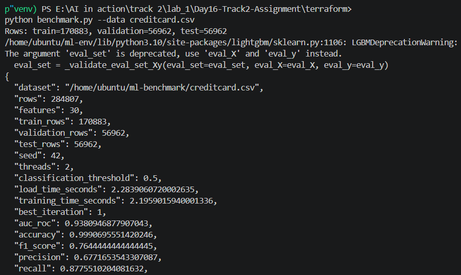
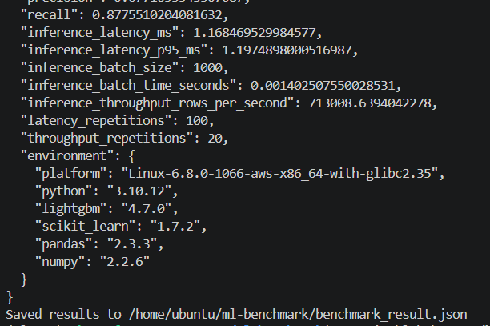
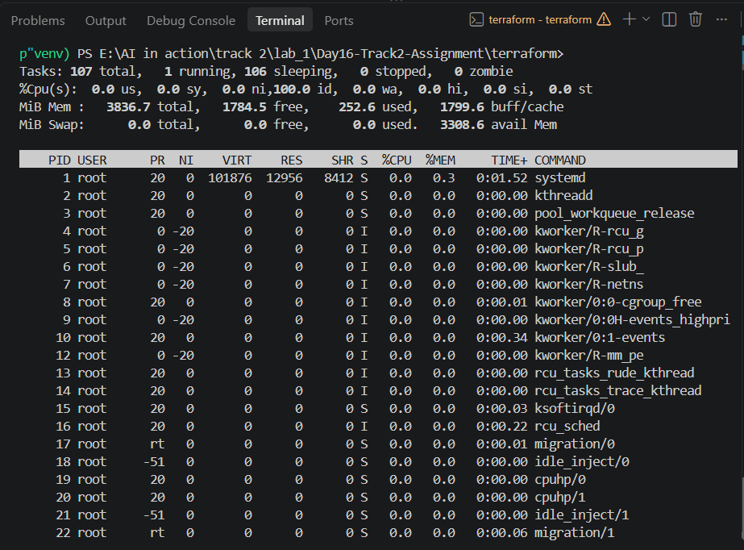
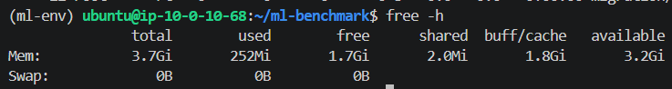
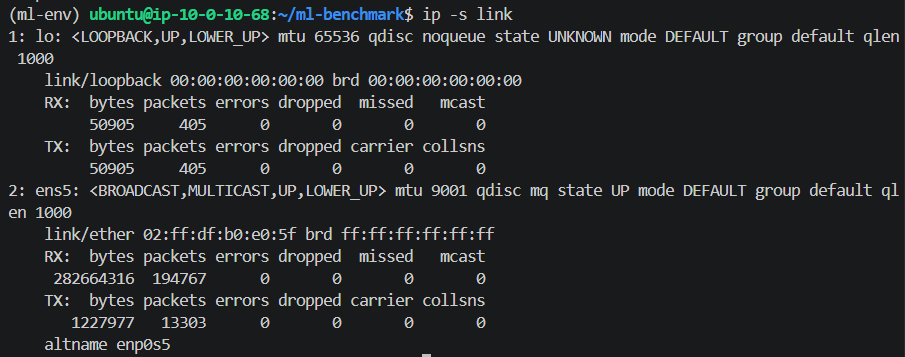

# Hướng dẫn Thực hành LAB 16: Cloud AI Environment Setup (2.5h)

Chào mừng các bạn đến với Lab 16. Trong bài thực hành này, chúng ta sẽ thiết lập một môi trường Cloud AI hoàn chỉnh trên AWS bằng cách sử dụng **Terraform** (Infrastructure as Code).

**Luồng chính (bắt buộc) của bài lab:** triển khai hạ tầng bằng Terraform, khởi động một **CPU instance nhỏ** (`t3.medium`), và huấn luyện + inference một mô hình **LightGBM** (gradient boosting) thực tế trên đó — không cần GPU, không cần xin quota, không cần tài khoản Hugging Face.

Ở cuối bài có thêm **Phụ lục (Tùy chọn — bài tập nâng cao)**: nếu bạn muốn thử sức và tài khoản của mình xin được quota GPU, bạn có thể triển khai một mô hình ngôn ngữ lớn (LLM — `google/gemma-4-E2B-it`) lên máy chủ GPU (NVIDIA T4) bằng Docker/vLLM, phục vụ qua Load Balancer. Phần này **không bắt buộc** để hoàn thành lab.

> Không có tài khoản AWS hoặc GCP? Xem [`README_other_clouds.md`](README_other_clouds.md) để làm lab này trên **Azure** hoặc **Oracle Cloud (OCI — có gói Always Free, chi phí $0)**.

---

## Phần 1: Chuẩn bị tài khoản AWS và thiết lập IAM (Least-Privilege)

Để làm việc với AWS an toàn, chúng ta không bao giờ sử dụng tài khoản Root. Thay vào đó, bạn sẽ tạo một IAM User thuộc một IAM Group với các quyền vừa đủ (least-privilege) để Terraform có thể triển khai hạ tầng.

### Bước 1.1: Truy cập AWS Console
1. Đăng nhập vào [AWS Management Console](https://console.aws.amazon.com/) bằng tài khoản Root hoặc tài khoản Admin của bạn.
2. Trên thanh tìm kiếm, gõ **IAM** và chọn dịch vụ **IAM (Identity and Access Management)**.

### Bước 1.2: Tạo IAM Group và gắn quyền (Policies)
1. Trong menu bên trái của IAM, chọn **User groups** -> click **Create group**.
2. Đặt tên nhóm: `AI-Lab-Group`.
3. Trong phần **Attach permissions policies**, bạn cần tìm và tick chọn các quyền (roles) sau. **Giải thích tại sao cần:**
   - `AmazonEC2FullAccess`: Cần thiết để Terraform tạo máy chủ ảo (Bastion Host, Compute Node), Key Pairs, và Security Groups.
   - `AmazonVPCFullAccess`: Cần thiết để Terraform tạo môi trường mạng (VPC, Subnets, Internet Gateway, NAT Gateway, Route Tables).
   - `ElasticLoadBalancingFullAccess`: Cần thiết để tạo Application Load Balancer (ALB) — hạ tầng này vẫn được triển khai trong luồng chính để bạn thực hành, dù chỉ thực sự được dùng để phục vụ API khi làm Phụ lục GPU + LLM.
   - `IAMFullAccess`: Bắt buộc vì Terraform script của chúng ta sẽ tạo một IAM Role và Instance Profile (gắn vào compute node để cấp quyền cho node nếu cần tương tác với AWS services sau này).
4. Click **Create user group**.

### Bước 1.3: Tạo IAM User và lấy Access Keys
1. Trong menu bên trái, chọn **Users** -> click **Create user**.
2. Đặt tên user: `ai-lab-user`. Click Next.
3. Chọn **Add user to group**, tick chọn nhóm `AI-Lab-Group` vừa tạo. Click Next -> **Create user**.
4. Bấm vào tên user `ai-lab-user` vừa tạo. Chuyển sang tab **Security credentials**.
5. Kéo xuống phần **Access keys**, click **Create access key**.
6. Chọn **Command Line Interface (CLI)** -> Check đồng ý -> Next -> **Create access key**.
7. **LƯU Ý:** Copy `Access key ID` và `Secret access key` lưu vào nơi an toàn. Bạn sẽ không thể xem lại Secret key sau khi đóng cửa sổ này.

> **Về GPU Quota:** Luồng chính của bài lab này **không cần** xin tăng quota GPU. Nếu bạn muốn làm thêm Phụ lục (tùy chọn) ở cuối bài để triển khai LLM trên GPU, quy trình xin quota được hướng dẫn riêng ở đó.

---

## Phần 2: Cài đặt và cấu hình môi trường Local

Trên máy tính cá nhân của bạn, mở Terminal/Command Prompt.

### Bước 2.1: Cấu hình AWS CLI
Đảm bảo bạn đã cài đặt [AWS CLI](https://aws.amazon.com/cli/). Gõ lệnh sau để cấu hình tài khoản vừa tạo:
```bash
aws configure
```
Nhập các thông tin:
- **AWS Access Key ID**: (Dán Access key ID của bạn)
- **AWS Secret Access Key**: (Dán Secret access key của bạn)
- **Default region name**: `us-east-1` (Bắt buộc dùng us-east-1 cho lab này)
- **Default output format**: `json`

### Bước 2.2: Tạo SSH Key Pair cho Terraform
Terraform cần một public key có sẵn để tạo Key Pair trên AWS (dùng để SSH vào Bastion Host và Compute Node). Trong thư mục `terraform`, chạy:
```bash
cd terraform
ssh-keygen -t rsa -b 4096 -f lab-key -N ""
```
Lệnh này tạo ra hai file: `lab-key` (private key, giữ bí mật) và `lab-key.pub` (public key, Terraform sẽ đọc file này). Cả hai đã nằm trong `.gitignore` nên sẽ không bị commit nhầm.

*(Nếu bạn định làm Phụ lục GPU + LLM ở cuối bài, phần đó cần thêm một Hugging Face Token — sẽ được hướng dẫn lấy ngay tại đó, không cần chuẩn bị trước.)*

---

## Phần 3: Triển khai Hạ tầng với Terraform

Terraform là công cụ giúp chúng ta khởi tạo hạ tầng AWS hoàn toàn tự động bằng code. Kiến trúc bao gồm:
- Mạng **Private VPC** cách ly hoàn toàn với bên ngoài.
- **Bastion Host** (t3.micro) ở Public Subnet: Dùng làm trạm trung chuyển an toàn để SSH vào Compute Node.
- **Compute Node** (`t3.medium` — 2 vCPU / 4 GB RAM) ở Private Subnet: Đây là nơi bạn sẽ cài đặt và chạy LightGBM. Instance này **mặc định là CPU**; hạ tầng đã được viết sẵn để chuyển sang GPU (`g4dn.xlarge`) nếu bạn làm Phụ lục ở cuối bài, thông qua biến `enable_gpu`.
- **NAT Gateway**: Cho phép Private Subnet tải package/dataset từ internet.
- **Application Load Balancer (ALB)**: Mở cổng 80 (HTTP), trỏ vào cổng 8000 của Compute Node. Ở luồng CPU mặc định sẽ chưa có gì lắng nghe cổng 8000 nên **health check của ALB sẽ hiển thị "unhealthy" — đây là điều bình thường**, bạn không cần xử lý gì cả trừ khi làm Phụ lục GPU + LLM.

### Bước 3.1: Khởi tạo Terraform
Di chuyển vào thư mục code Terraform (nếu bạn chưa ở đó từ Bước 2.2):
```bash
cd terraform
terraform init
```

### Bước 3.2: Triển khai (Apply)
Với luồng CPU mặc định, bạn **không cần khai báo biến môi trường nào cả** — chỉ cần chạy:
```bash
terraform apply
```
Gõ `yes` khi được hỏi. Quá trình này sẽ mất khoảng **10 đến 15 phút** (phần lớn thời gian là để khởi tạo NAT Gateway).

*Mẹo: Các bạn hãy bắt đầu bấm giờ (benchmark) từ lúc gõ `yes` ở bước này nhé!*

---

## Phần 4: Kết nối và Huấn luyện mô hình LightGBM trên CPU Node

Khi `terraform apply` chạy xong, màn hình terminal sẽ in ra các thông số quan trọng (Outputs). Trông sẽ giống thế này:
```text
Outputs:

alb_dns_name = "ai-inference-alb-xxxxxx.us-east-1.elb.amazonaws.com"
bastion_public_ip = "100.x.x.x"
endpoint_url = "http://ai-inference-alb-xxxxxx.us-east-1.elb.amazonaws.com/v1/completions"
gpu_private_ip = "10.0.1x.x"
```
`gpu_private_ip` chính là IP private của Compute Node (CPU) bạn vừa tạo — tên biến giữ nguyên từ hạ tầng dùng chung với phần GPU tùy chọn. `endpoint_url`/`alb_dns_name` chỉ có ý nghĩa nếu bạn làm Phụ lục GPU + LLM ở cuối bài; ở luồng CPU bạn có thể bỏ qua hai giá trị này.

### Bước 4.1: SSH vào Compute Node qua Bastion Host
```bash
# SSH vào Bastion Host
ssh -i lab-key ubuntu@<BASTION_PUBLIC_IP>

# Từ Bastion, SSH vào Compute Node (dùng IP private ở trên)
ssh ubuntu@<CPU_PRIVATE_IP>
```

### Bước 4.2: Kiểm tra môi trường ML
Terraform đã tự động cài sẵn Python, LightGBM, scikit-learn, pandas, numpy và Kaggle CLI cho bạn qua `user_data`. Đợi khoảng 1-2 phút sau khi instance chạy xong rồi kiểm tra:
```bash
python3 -c "import lightgbm, sklearn, pandas, numpy; print('OK')"
```
Nếu chưa thấy `OK` (do user_data còn đang chạy), xem log cài đặt bằng:
```bash
sudo tail -f /var/log/user-data.log
```

### Bước 4.3: Tải Dataset từ Kaggle

Chúng ta sẽ dùng **Credit Card Fraud Detection** — bộ dữ liệu chuẩn cho benchmark ML với 284,807 giao dịch thực.

**Lấy Kaggle API Key:**
1. Đăng nhập [kaggle.com](https://www.kaggle.com) -> **Settings** -> **API** -> **Create New Token** -> tải về `kaggle.json`.
2. Copy nội dung file vào máy EC2:

```bash
mkdir -p ~/.kaggle
# Tạo file credentials (thay YOUR_USERNAME và YOUR_KEY):
cat > ~/.kaggle/kaggle.json << 'EOF'
{"username": "YOUR_KAGGLE_USERNAME", "key": "YOUR_KAGGLE_API_KEY"}
EOF
chmod 600 ~/.kaggle/kaggle.json

mkdir -p ~/ml-benchmark
kaggle datasets download -d mlg-ulb/creditcardfraud --unzip -p ~/ml-benchmark/
```

### Bước 4.4: Huấn luyện và Inference với LightGBM

Viết một script Python (ví dụ `benchmark.py`) thực hiện:
1. Load dataset và tách tập train/test.
2. Huấn luyện một `LGBMClassifier` (hoặc `lightgbm.train`) để phát hiện gian lận.
3. Đo thời gian load data và thời gian training.
4. Đánh giá model trên tập test: AUC-ROC, Accuracy, F1-Score, Precision, Recall.
5. Đo **inference latency** (dự đoán 1 dòng) và **inference throughput** (dự đoán 1000 dòng).
6. Ghi toàn bộ kết quả ra file `benchmark_result.json`.

Chạy script và điền kết quả vào bảng:

| Metric | Kết quả |
|---|---|
| Thời gian load data | 2,283906 giây |
| Thời gian training | 2,195902 giây |
| Best iteration | 1 |
| AUC-ROC | 0,938095 |
| Accuracy | 99,906956% |
| F1-Score | 0,764444 |
| Precision | 67,716535% |
| Recall | 87,755102% |
| Inference latency (1 row) | 1,168470 ms (trung bình 100 lần đo) |
| Inference throughput (1000 rows) | 713.008,64 dòng/giây (batch 1.000 dòng; trung bình 20 lần đo) |

**Ảnh output benchmark (2 phần):**





---

## Phần 5: Kiểm tra Tài nguyên và Chi phí

Ngay sau khi chạy xong benchmark, hãy kiểm tra và chụp lại các chỉ số sau (không cần đợi 1 giờ):

### 5.1: CPU, RAM, Network usage (trên Compute Node, qua SSH)
```bash
# CPU usage theo thời gian thực (nhấn q để thoát)
top

# RAM usage
free -h

# Network usage (số byte/gói tin đã gửi-nhận qua interface)
ip -s link
```
Bạn cũng có thể xem các chỉ số này trên **EC2 Console -> Instances -> chọn Compute Node -> tab Monitoring** (biểu đồ `CPUUtilization`, `NetworkIn`, `NetworkOut`).

**Kết quả ghi nhận sau benchmark:**

| Tài nguyên | Kết quả từ ảnh chụp |
|---|---|
| CPU (`top`) | 100,0% idle, tương đương khoảng 0% sử dụng tại thời điểm chụp; 107 tác vụ, gồm 1 đang chạy và 106 đang ngủ |
| RAM (`free -h`) | Tổng 3,7 GiB; đang dùng 252 MiB; trống 1,7 GiB; buff/cache 1,8 GiB; khả dụng 3,2 GiB |
| Swap | 0 B |
| Network RX (`ens5`) | Nhận 282.664.316 bytes, 194.767 gói tin; 0 lỗi, 0 gói bị drop |
| Network TX (`ens5`) | Gửi 1.227.977 bytes, 13.303 gói tin; 0 lỗi, 0 gói bị drop |

Tại thời điểm chụp sau benchmark, CPU gần như nhàn rỗi và RAM còn khả dụng khoảng 3,2 GiB. Các số liệu này phản ánh trạng thái sau khi chương trình kết thúc, không phải mức sử dụng tài nguyên cao nhất trong lúc huấn luyện. RX/TX là bộ đếm lưu lượng tích lũy của interface `ens5`, không phải tốc độ mạng hoặc lưu lượng riêng của benchmark.

**CPU — lệnh `top`:**



**RAM — lệnh `free -h`:**



**Network — lệnh `ip -s link`:**



### 5.2: Billing / Cost Dashboard
1. Vào [AWS Billing Console](https://console.aws.amazon.com/billing/) -> **Bills** hoặc **Cost Explorer**.
2. Chọn ngày hôm nay để xem chi phí hiện tại.
3. Chụp màn hình thể hiện các dịch vụ đang phát sinh chi phí (EC2, NAT Gateway).

**Ước tính chi phí/giờ (us-east-1) cho luồng CPU mặc định:**

| Dịch vụ | Instance/Loại | Chi phí/giờ |
|---|---|---|
| EC2 — Compute Node | `t3.medium` | ~$0.0416 |
| EC2 — Bastion | `t3.micro` | ~$0.010 |
| NAT Gateway | (mỗi AZ) | ~$0.045 + data |
| ALB | Application Load Balancer | ~$0.008 |
| **Tổng ước tính** | | **~$0.10/giờ** |

---

## Phần 6: Tiêu chí nộp bài (Deliverables)

Checklist hồ sơ nộp bài — luồng CPU:

- [x] **Screenshot terminal benchmark:** đã chèn 2 ảnh toàn bộ output tại phần 4.4.
- [x] **File kết quả:** [benchmark_result.json](terraform/benchmark_result.json) chứa đầy đủ metrics; bảng kết quả ở phần 4.4.
- [x] **Screenshot tài nguyên:** đã chèn ảnh CPU, RAM và Network, kèm nhận xét tại phần 5.1.
- [x] **Ghi nhận mục Billing nộp bổ sung sau:** ảnh AWS Billing/Cost Dashboard ở phần 5.2 hiện chưa có.
- [x] **Mã nguồn:** đã đóng gói thư mục `terraform/`; liên kết ZIP nằm trong báo cáo ngắn bên dưới.
- [x] **Báo cáo ngắn:** đã ghi nhận xét về training time, AUC và inference trên CPU bên dưới.

### Báo cáo ngắn

1. Benchmark sử dụng 284.807 giao dịch với 30 đặc trưng, chạy trên CPU với 2 luồng.
2. Dữ liệu được chia thành 60% training, 20% validation và 20% test; validation dùng cho early stopping, test dùng để đánh giá cuối.
3. Thời gian tải dữ liệu khoảng 2,284 giây và huấn luyện khoảng 2,196 giây.
4. Mô hình đạt AUC-ROC 0,9381 và F1-score 0,7644 trên tập test.
5. Recall đạt 87,76%, trong khi Precision đạt 67,72%, cho thấy vẫn có các cảnh báo gian lận sai.
6. Độ trễ trung bình cho một dòng là 1,168 ms; throughput với batch 1.000 dòng đạt khoảng 713.009 dòng/giây sau bước khởi động.
7. Best iteration bằng 1 góp phần giúp mô hình dự đoán nhanh; Accuracy 99,91% cần được đánh giá cùng Precision, Recall và F1 do dữ liệu mất cân bằng.
8. Mã nguồn và kết quả được đóng gói trong [terraform_submission.zip](terraform_submission.zip), gồm mã Terraform, script khởi tạo, script benchmark, kết quả JSON, file khóa phiên bản provider và `requirements.txt`; không kèm khóa SSH, thông tin xác thực, Terraform state hoặc cache `.terraform/`.
9. Trong lần chạy thực tế, bước cài `python3-pip` tự động thất bại nên thư viện được cài trong môi trường `~/ml-env`; người chạy lại cần chuẩn bị môi trường Python và tạo khóa SSH riêng theo bước 2.2.

---

## Phần 7: Dọn dẹp tài nguyên (CỰC KỲ QUAN TRỌNG)

NAT Gateway tính phí theo giờ ngay cả khi dùng CPU instance nhỏ. Ngay sau khi test thành công và chụp ảnh nộp bài, bạn **BẮT BUỘC** phải xóa toàn bộ tài nguyên để tránh mất tiền.

Chạy lệnh sau trong thư mục `terraform`:
```bash
terraform destroy
```
Gõ `yes` khi được hỏi. Quá trình xóa sẽ mất khoảng 5 phút. Hãy đợi đến khi terminal báo `Destroy complete!` để chắc chắn mọi thứ đã bị xóa.
